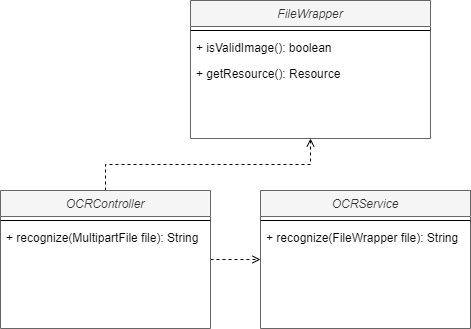
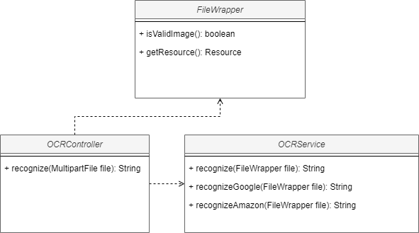

## Atividades

1. Create an endpoint to receive an image and extract text from it using OCR (Optical Character Recognition).

Solução:

2. We want to evolve to store quotas, and if a provider's quota is exceeded, it should retrieve from another provider.

Solution:

