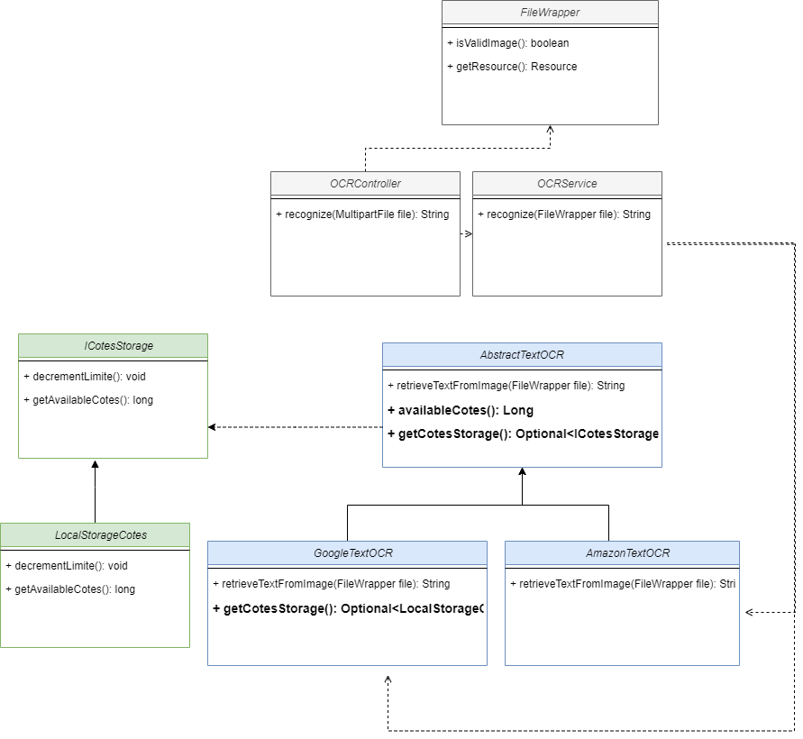
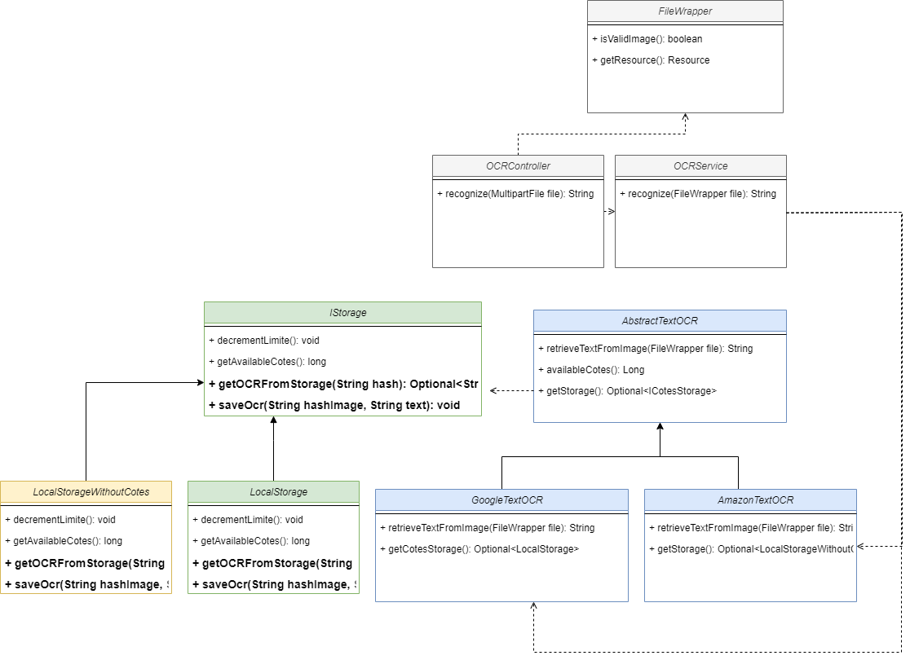

## Atividades

1. Criar um endpoint para receber uma imagem e extrair o texto dela, OCR (Optical Character Recognition).

Solution:

2. Queremos evoluir para suportar o serviço do Google e da Cloudinary.
   Caso o serviço do Cloudinary esteja indisponível a chamada deverá ser feita para o do Google.

Solution:

3. Queremos evoluir para armazenar as cotas, e caso exceda as cotas de um provedor, ele deverá buscar no outro provedor.

Solution:

4. Estamos recebendo muitas requisições, queremos armazenar o texto gerado em Banco de dados.

Solution:

