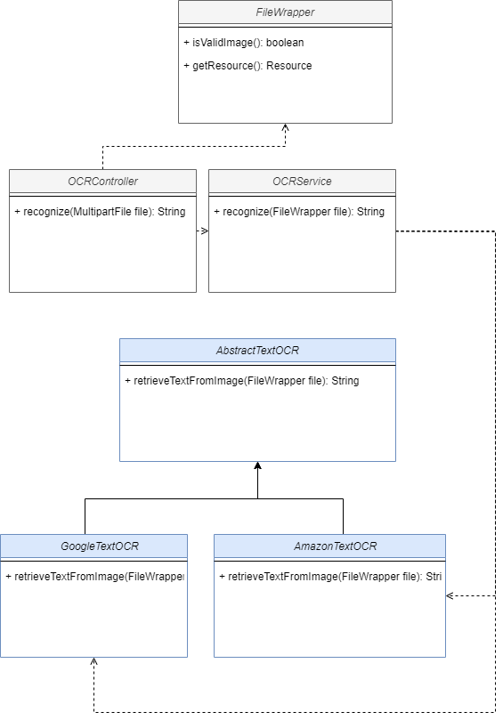

## Atividades

1. Criar um endpoint para receber uma imagem e extrair o texto dela, OCR (Optical Character Recognition).

Solution:

2. Queremos evoluir para suportar o serviço do Google e da Cloudinary.
   Caso o serviço do Cloudinary esteja indisponível a chamada deverá ser feita para o do Google.

Solution:

