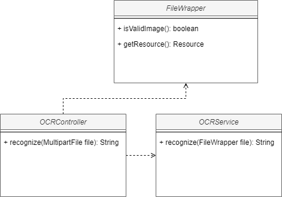
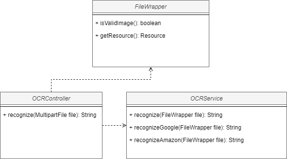

## Atividades

1. Criar um endpoint para receber uma imagem e extrair o texto dela, OCR (Optical Character Recognition).

Solution:

2. Queremos evoluir para armazenar as cotas, e caso exceda as cotas de um provedor, ele deverá buscar no outro provedor.

Solution:

